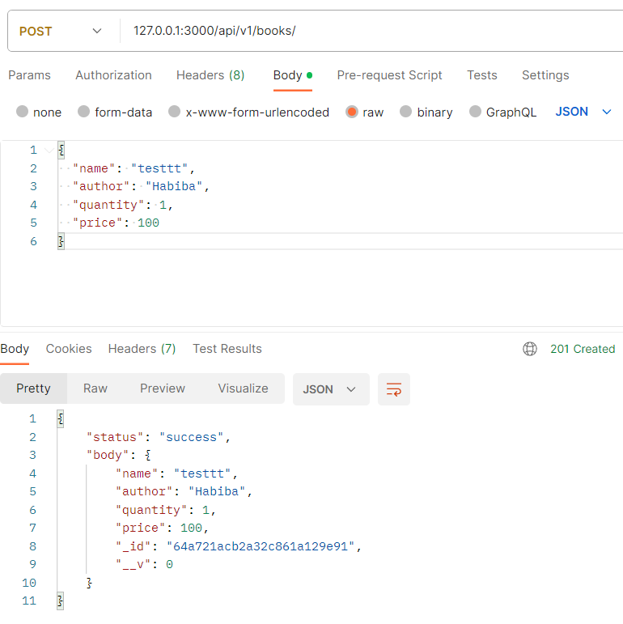
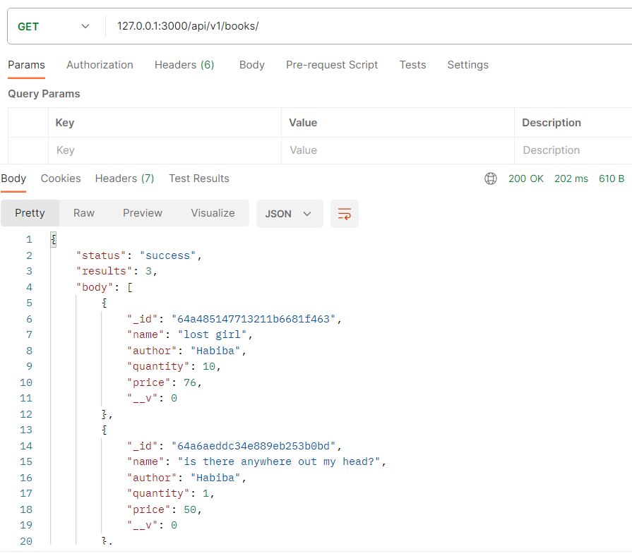
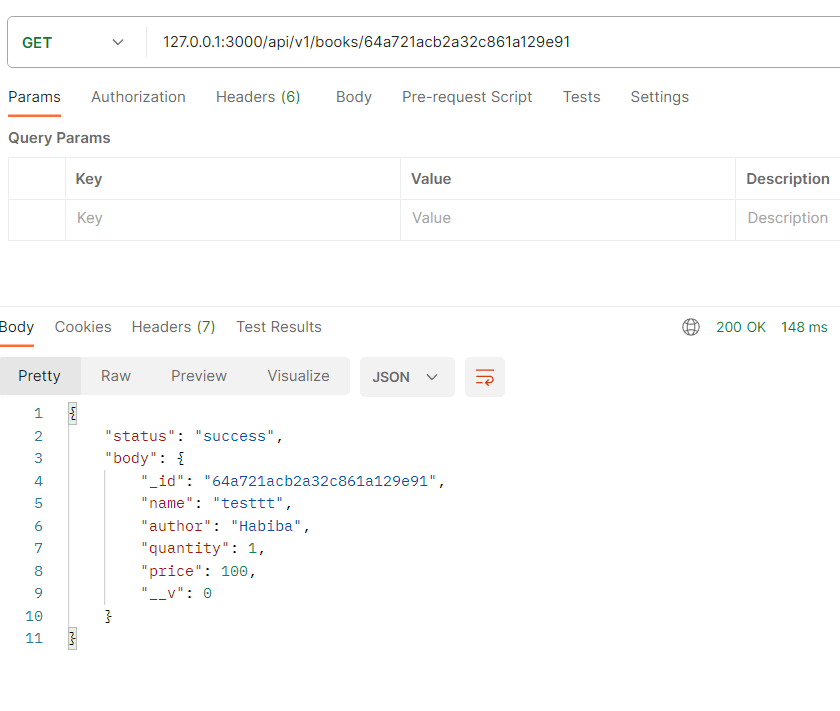
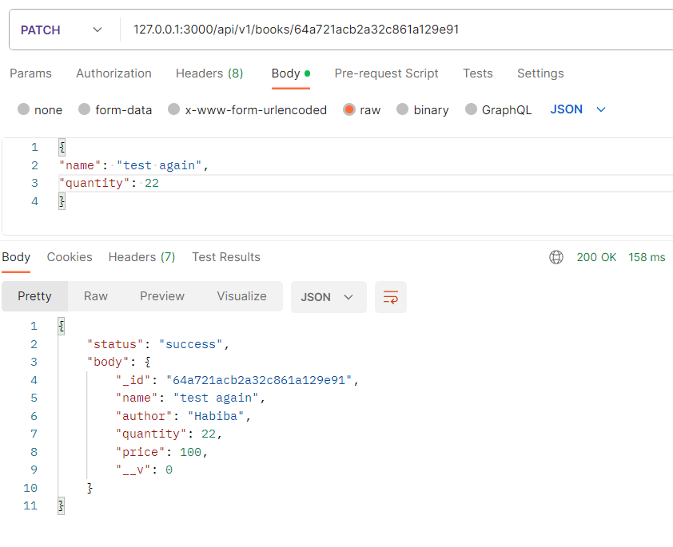
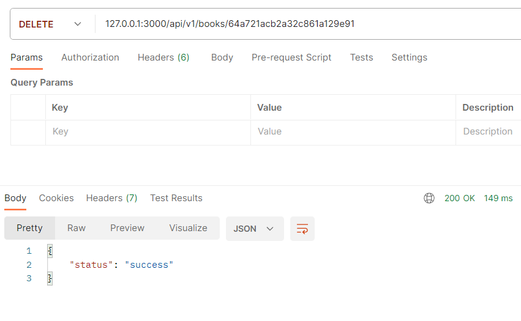

# Simple CRUD node project

- I used MongoDB and created a simple collection called { books }

- Create a new document:



- Read all documents



- Read a document by its ID




- Update a document




- Delete a document




## the 'books' schema model is created using mongoose library an object modeling tool for MongoDB and Node.js.

```js
const bookSchema = new mongoose.Schema({
    name: {
        type: String,
        required: [true, 'A book must have a name'],
        unique: true
    },
    author: {
        type: String,
        required: [true, 'A book must have an author']
    },
    quantity:{
        type: Number,
        default: 1
    },
    price:{
        type: Number,
        required: [true, 'A book must have a price']
    }
})
```